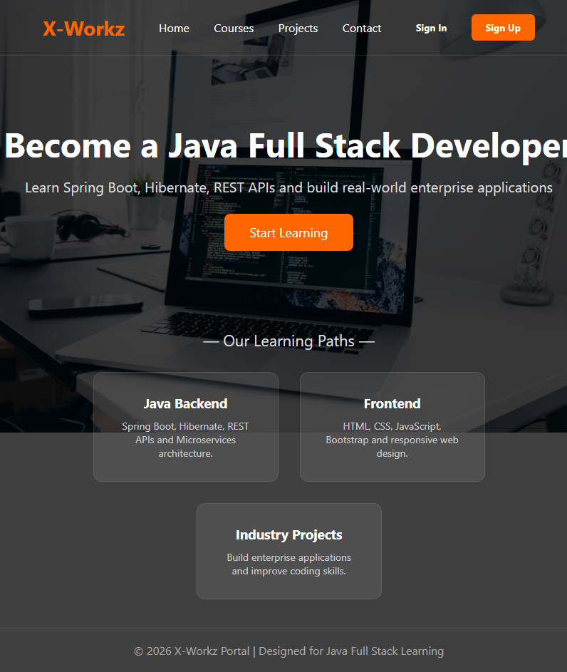
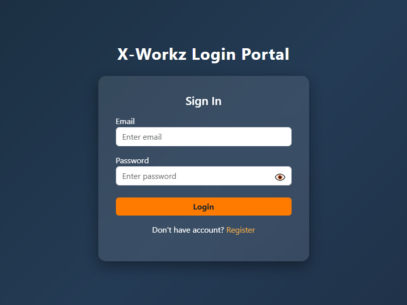
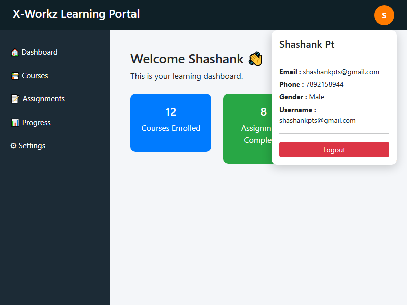
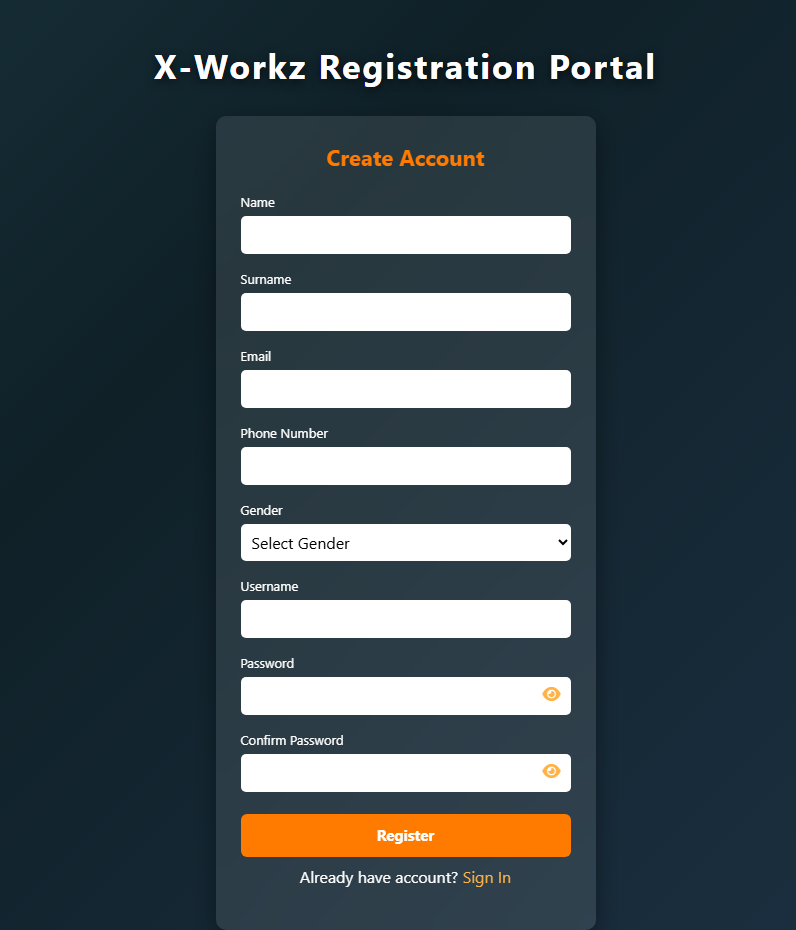

# X-Workz Learning Portal

## 🔹 Project Description
A full-stack Java web application for user authentication and learning dashboard.

## 🔹 Tech Stack
- Java
- Spring MVC
- Hibernate (JPA)
- MySQL
- JSP
- Bootstrap

## 🔹 Features
- User Registration & Login
- BCrypt Password Encryption
- Account Lock after 3 failed attempts
- Password Reset Functionality
- Session Management
- Form Validation (Frontend + Backend)

## 🔹 Screenshots

## 🔹 How to Run
1. Import project in IntelliJ
2. Configure MySQL database
3. Run on Apache Tomcat server
